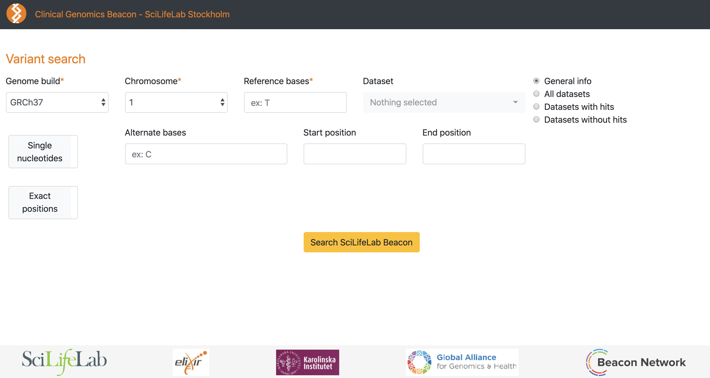

## Beacon endpoints and queries

1. [ Info endpoint ](#info)
1. [ Query endpoint ](#query)
1. [ Queries using the web interface ](#webform)
1. [ Advanced query parameters ](#advanced)

<a name="endpoints"></a>
## Server endpoints

<a name="info"></a>
- **/info**.
General info regarding this Beacon, including a description of its datasets, API version, sample count etc, can be obtained by sending a GET request using the following shell command:
```
curl -X GET 'http://localhost:5000/apiv1.0/info'
```

Demo beacon will reply to this request with a JSON object like this:
```
{"alternativeUrl":null,"apiVersion":"v1.0.0","createDateTime":"Tue, 23 Jun 2020 14:33:52 GMT","datasets":[{"assembly_id":"GRCh37","callCount":483,"created":"Tue, 23 Jun 2020 14:33:52 GMT","id":"test_public","info":{"accessType":"PUBLIC"},"name":"Test public dataset","sampleCount":1,"updated":"Tue, 23 Jun 2020 14:33:53 GMT","variantCount":408,"version":1.0}],"description":"Beacon description","id":"SciLifeLab-beacon","name":"SciLifeLab Stockholm Beacon","organisation":{"address":"","contactUrl":"","description":"A science lab","id":"scilifelab","info":[],"logoUrl":"","name":"Clinical Genomics, SciLifeLab","welcomeUrl":""},"sampleAlleleRequests":[{"alternateBases":"A","assemblyId":"GRCh37","datasetIds":["test_public"],"includeDatasetResponses":"HIT","referenceBases":"C","referenceName":"1","start":156146085},{"assemblyId":"GRCh37","includeDatasetResponses":"ALL","referenceBases":"C","referenceName":"20","start":54963148,"variantType":"DUP"}],"updateDateTime":"Tue, 23 Jun 2020 14:33:53 GMT","version":"v1.1","welcomeUrl":null}
```

<a name="query"></a>
- **/query**.
Query endpoint supports both GET and POST requests.
Example of a GET request:
```
curl -X GET \
  'http://localhost:5000/apiv1.0/query?referenceName=1&referenceBases=C&start=156146085&assemblyId=GRCh37&alternateBases=A'
```

Example of a POST request:
```
curl -X POST \
  -H 'Content-Type: application/json' \
  -d '{"referenceName": "1",
  "start": 156146085,
  "referenceBases": "C",
  "alternateBases": "A",
  "assemblyId": "GRCh37",
  "includeDatasetResponses": "HIT"}' http://localhost:5000/apiv1.0/query
```

The Beacon reply to a query of this type would be a json object where the "exist" key will be true if the allele is found, otherwise it will be false.
```
{"allelRequest":{"alternateBases":"A","assemblyId":"GRCh37","datasetIds":[],"includeDatasetResponses":"NONE","referenceBases":"C","referenceName":"1","start":"156146085"},"apiVersion":"1.0.0","beaconId":"SciLifeLab-beacon","datasetAlleleResponses":[],"error":null,"exists":true}
```

<a name="webform"></a>
## Web interface
A simple web interface to perform interactive queries can be used by typing the following address in any browser window: `http://127.0.0.1:5000/apiv1.0/query_form`



At the moment this interface is disconnected with Elixir AAI so all queries will be limited to the available public datasets in the Beacon.

[ga4gh_api1]: https://github.com/ga4gh-beacon/specification/blob/develop/beacon.md


<a name="advanced"></a>
## Advanced queries

### Required parameters
* `assemblyId`: Genome build (GRC notation, example: GRCh37).  
* `referenceName`: Chromosome name () 1-22, X, Y, MT).
* `referenceBases`: Reference bases for a variant. Accepted values: `[ACGT]*`.  
* `start`: Precise start coordinate position, allele locus (0-based).  
  * `start` coordinate:  
     * for single positions, in general for retrieving information on SNVs and InDels.
     * the use of `start` without an `end` parameter requires the use of `referenceBases`.  
  * `start` and `end` coordinates:  
    * In general used to retrieve information for structural variants where start and end exact positions are known.
* `startMin`: Minimum start coordinate
    * for querying imprecise positions, for instance when a structural variants is suspected to have a breakpoint within a `startMin` and `startMax` interval. Similarly variants with the other breakpoint ending in another interval can be found by specifying `endMin` and `endMax` coordinates.  
* `startMax`: Maximum start coordinate. See `startMin`.  
* `end`: Precise end coordinate (0-based, exclusive). See `start`.  
* `endMin`: Minimum end coordinate. See `startMin`.  
* `endMax`: Maximum end coordinate. See `startMin`.  

Either Start and/or End coordinates or range coordinates must be specified in the query.

### Additional optional parameters

* `variantType`: is used especially to query structural variants.
    Examples: SNV, DEL, DUP, BND ..
* `alternateBases`: The bases that appear instead of the reference bases. Accepted values:`[ACGT]*`

Either `alternateBases` or `variantType` is required in all queries

* `datasetIds`: specific dataset IDs to search in. If this parameter is not provided then all datasets of a beacon will be searched.
* `includeDatasetResponses`: whether if the beacon should return a dataset-specific response or a simple yes/no reply. Accepted values:
  - `ALL`: return a specific result from all available datasets in the beacon.
  - `HIT`: return a specific result from from all dataset where there is a positive match for the variant.
  - `MISS`: return a specific result from from all dataset where the variant was not found.
  - `NONE`: do not include dataset-specific info in the request. The same type of request is obtained when `includeDatasetResponses` parameter is not provided.

The advantage of including `includeDatasetResponses` in query is that in case of positive match, other useful statistics will be returned at the dataset level, such as `variantCount`, `callCount` and `sampleCount`.

This is an example of a positive match response from this beacon populated with demo data:
```
{"allelRequest":{"alternateBases":"A","assemblyId":"GRCh37","datasetIds":[],"includeDatasetResponses":"HIT","referenceBases":"C","referenceName":"1","start":156146085},"apiVersion":"1.0.0","beaconId":"SciLifeLab-beacon","datasetAlleleResponses":[{"callCount":1,"datasetId":"test_public","exists":true,"info":{"accessType":"PUBLIC"},"sampleCount":1,"variantCount":1}],"error":null,"exists":true}
```
